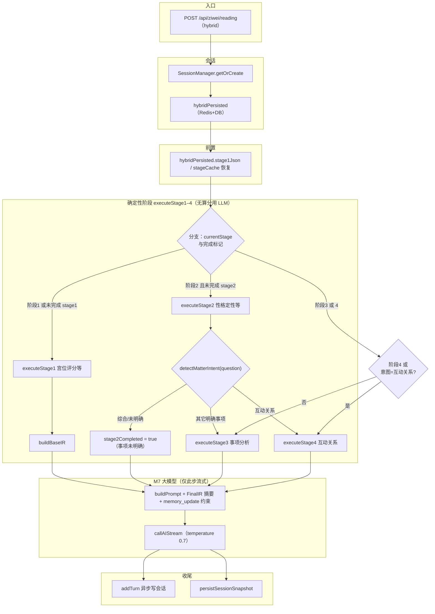
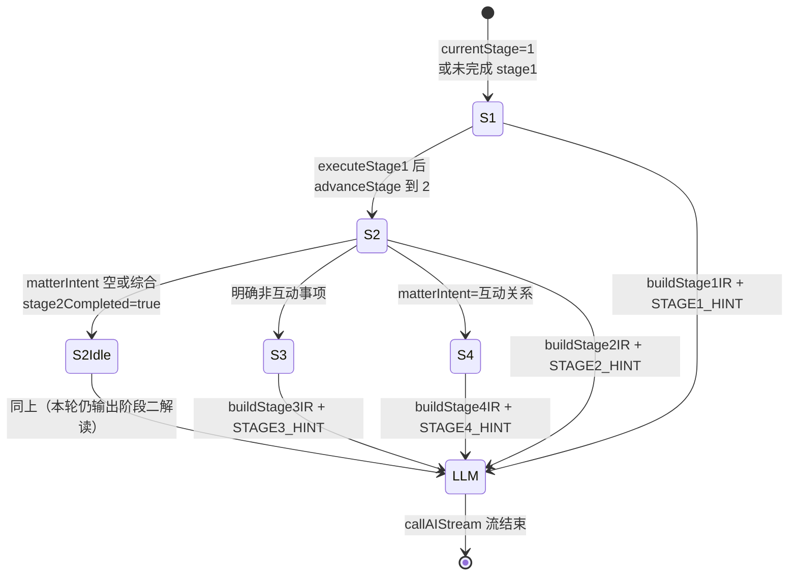

# 程序混合架构 — 当前实现流程与逻辑文档

> 生成时间：2026-05-08
> 基于代码：`src/lib/ziwei/hybrid/` + `src/core/stages/` + `src/core/orchestrator/state-machine.ts` + `src/lib/ziwei/rag/session-manager.ts`

---

## 一、整体架构

```
用户请求 POST /api/ziwei/reading
  │
  ▼
runHybridPipeline()（`src/lib/ziwei/hybrid/orchestrator.ts`）
  │
  ├─ SessionManager.getOrCreate() ── Redis + MySQL（`hybrid_state` JSON）
  ├─ hybridPersisted：状态机 + stage1–4 JSON + 对话历史（≤6 条）+ collected
  ├─ 兼容恢复: stageCache.stage1/stage2 → hybridPersisted.stage1Json/stage2Json
  ├─ ChartBridge: buildBaseIR(chartData) → BaseIR
  │
  ├─ 状态机判断当前阶段 (1→2→3/4)
  │
  ├─ 阶段一: executeStage1() ── 排盘 + 四化 + 评分
  ├─ 阶段二: executeStage2() ── 性格定性 + 四维合参
  ├─ 阶段三: executeStage3() ── 事项分析 + 行运 + 方向矩阵
  ├─ 阶段四: executeStage4() ── 太岁入卦 + 三维合参
  │
  ├─ 知识注入 (M6): 各阶段独立查询 KnowledgeDict
  ├─ IR 构建: StageOutput → IR (中间表示)
  ├─ Prompt 组装: IR + 知识片段 + 阶段提示 → Messages
  ├─ callAIStream() → 流式 LLM 输出
  │
  ├─ buildFinalIRFromStages + patterns DSL 调试字段
  └─ persistSessionSnapshot(session) → Redis + MySQL hybrid_state
```

### 一（附）、流程图（Mermaid）

编排见 `src/lib/ziwei/hybrid/orchestrator.ts`；`pipeline-orchestrator.ts` 仅为兼容 re-export。**`handleSoftInterrupt` 当前恒为放行**（`state-machine.ts`）。

#### 总览：程序阶段 → 唯一流式 LLM（M7）



说明：

- 无 `chartData` 且需排盘时，编排器会 **早退**：仅 `callAIStream` 提示缺盘（仍属 LLM，但无 Stage 输出）。
- 处于 **阶段 3/4** 时若缺 `stage1Output` / `stage2Output`，会先 **自动补全** `executeStage1` / `executeStage2` 再执行 Stage3 或 Stage4。

#### 状态与阶段推进（与编排分支对齐）



## 二、P1 阶段一：命盘生成 + 宫位评分

**入口**: `executeStage1(input: Stage1Input): Stage1Output`

**流程**:
1. `convertIztroToScoringContext(chartData)` — iztro JSON → ScoringContext
   - 提取 birthGan: `extractBirthGan(solarDate)` — 正则取年份 → 天干表
   - taiSuiZhi: 取 `earthlyBranchOfBodyPalace`，默认 `'寅'`
   - 遍历 12 宫，转换 majorStars/minorStars/stars/亮度
2. `calculateOriginalSihua(birthGan, taiSuiZhi)` — M1 四化计算
   - 生年四化 + 太岁宫宫干四化（五虎遁宫干）+ 特殊叠加检测
3. `applySihuaToPalaces(ctx, mergedSihua.entries)` — 四化标注到宫位星曜
4. 格局匹配: `allPatterns.filter(p => p.evaluate(accessor))` — 遍历 84 格局
5. `evaluateAllPalaces(ctx)` — M2 六步评分 → 12 宫 PalaceScore
6. `injectStage1Knowledge(palaceScores)` — M6 查询星曜赋性 + 宫位含义

**输出**: `Stage1Output { scoringCtx, palaceScores, allPatterns, mergedSihua, knowledgeSnippets, hasParentInfo }`

**已知问题**:
- ~~身宫索引 `findShenGong()` 返回固定值 6（对宫），未使用 iztro 的 `isBodyPalace` 标记~~ → **已修复**：chart-converter 使用 `findShenGongIndex()` 优先读 `isBodyPalace` 标记，ScoringContext 新增 `shenGongIndex` 字段
- `hasParentInfo` 仅在编排层通过关键词检测，未参与评分计算
- 父母太岁入卦遗传影响评分未实现

## 三、P2 阶段二：性格定性 + 事项问诊

**入口**: `executeStage2(input: Stage2Input): Stage2Output`

**流程**:
1. 确定三宫索引: mingIdx=0, shenIdx=ctx.shenGongIndex(从 iztro isBodyPalace 计算), taiSuiIdx=按地支查找
2. `generateFourDimensionTags()` × 3 — 命宫/身宫/太岁宫四维合参
   - 本宫标签 + 对宫投射 + 三合支撑 + 夹宫状态
3. `judgeThreePalaceTone()` — 三宫基调判定
4. `generateHolographicBase()` — 命宫全息底色
5. `injectStage2Knowledge()` — M6 查询三宫主星赋性

**输出**: `Stage2Output { mingGongTags, shenGongTags, taiSuiTags, overallTone, mingGongHolographic, knowledgeSnippets }`

**已知问题**:
- ~~身宫索引硬编码为 6，实际取决于出生时辰~~ → **已修复**：使用 `ctx.shenGongIndex ?? 6`，chart-converter 通过 iztro `isBodyPalace` 标记计算
- ~~未使用 iztro 的 `isBodyPalace` 属性~~ → **已修复**

## 四、P3 阶段三：事项分析

**入口**: `executeStage3(input: Stage3Input): Stage3Output`

**流程**:
1. `routeMatter(matterType, answers)` — M5 路由决策
   - answers 来自 `extractAnswersFromDialog()` 规则提取
2. 原局底盘分析: primaryAnalysis 含四维合参 + 格局护佑
3. `buildThreeLayerTable(scoringCtx, chartData, targetYear)` — 行运计算
   - `extractAllDaXianMappings()` — 从 iztro astrolabe 提取全部大限
   - 构建三层宫位对照表 (原局/大限/流年)
4. `calculateDirectionMatrix()` — 方向矩阵 (吉吉/吉凶/凶吉/凶凶)
5. `injectStage3Knowledge()` — M6 查询事项宫位 + 大限星曜

**输出**: `Stage3Output { matterType, primaryAnalysis, allDaXianMappings, threeLayerTable, directionMatrix, directionWindow, knowledgeSnippets }`

**已知问题**:
- ~~`extractAllDaXianMappings` 使用 `require('iztro')` 动态导入，可能在某些环境失败~~ → **已修复**：改为顶层 `import { astro } from 'iztro'`
- 大限宫位映射逻辑 `buildDaXianLayer` 使用 `(i + offset) % 12` 偏移，未验证正确性
- ~~`calculateDirectionMatrix` 仅看四化中化忌数量，过于简化~~ → **已修复**：改为加权计分（禄+2, 权+1, 科+0.5, 忌-2）+ 关键宫位加成
- ~~行运分析未对每个大限调用 M2 重新评分~~ → **已修复**：`buildDaXianScoringContext()` 为每个大限构建临时 ScoringContext 并调用 `evaluateAllPalaces()`

## 五、P4 阶段四：互动关系分析

**入口**: `executeStage4(input: Stage4Input): Stage4Output`

**流程**:
1. 计算对方天干地支: `(partnerYear - 4) % 10/12`
2. `buildVirtualChart(partnerGan, partnerZhi)` — M3 太岁入卦
   - 生年四化 + 太岁宫宫干四化 + 禄存/擎羊/陀罗 + 天魁/天钺 + 红鸾/天喜
3. `mapStarsToNatalChart()` — 将入卦星曜映射到命主实际宫位
   - 修正 `findStarPalace()` 从占位改为真实查找
4. `buildThreeDimensionAnalysis()` — 三维合参
   - 维度A: 入卦者心态(生年主早/遁干主晚)
   - 维度B: 命主底色(Session 取)
   - 维度C: 大限/流年引动
5. `extractTensionPoints()` — 按地支分组检测冲突(双忌/权忌/禄忌)
6. `injectStage4Knowledge()` — M6 查询互动取象 + 忌星三维取象

**输出**: `Stage4Output { interaction { partnerGan, partnerZhi, virtualChart, threeDimension, tensionPoints, adjustableAdvice, fixedRisks }, knowledgeSnippets }`

**已知问题**:
- `buildVirtualChart` 中的 `findStarPalace()` 仍返回占位值 '子'（virtual-chart.ts 原始实现），但 `mapStarsToNatalChart` 在 stage4 中修正了四化星的落位。非四化类星曜（禄存/擎羊等）基于查表法直接定位，无需占位修正。
- ~~E3 单方关系宫分析未实现~~ → **已修复**：`executeStage4Solo()` 分析夫妻宫 + 对宫 + 三合，推断关系倾向
- ~~三维合参的 dimensionC 描述过于泛化~~ → **已修复**：调用 `buildThreeLayerTable` 获取实际大限信息 + 流年天干

## 六、编排器状态流转

```
初始: Stage=1
  │
  ▼ 阶段一完成
Stage=2 (自动推进)
  │
  ▼ 阶段二完成 + 识别事项方向
  ├─ 互动关系 → Stage=4
  ├─ 求财/求职/... → Stage=3
  └─ 未明确 → 停在 Stage=2
  │
  ▼ Stage 3 ↔ 4 可交替
  C2→E4: focusContext={matterType, primaryPalace}
  E2→E4: focusContext=undefined
```

**柔性打断**: `handleSoftInterrupt()` 始终返回 `{ allowed: true }`，即不阻止跳步。

## 七、Session 持久化

- **L1 Redis**: `ziwei:session:{id}` 存完整 `ZiweiSessionData`（含 `hybridPersisted`）— 24h TTL
- **L2 MySQL**: `ziwei_sessions.hybrid_state`（Json）与 `turns` 等字段同步
- **Stage 缓存**: `session.stageCache` 与 `hybridPersisted.stage1Json/stage2Json` 双写兼容旧读路径
- **多轮 Hybrid 历史**: `appendAssistantReply` 解析尾部 JSON，合并 `memory_update` → `collected.eventAnswers`，`conversationHistory` 最多 6 条
- **恢复顺序**: Redis 命中 → 缺 hybrid 时补读 DB `hybrid_state`；Redis 未命中 → DB 整包恢复

## 八、API Route

| 路由 | 自动补全 | 返回格式 |
|------|---------|---------|
| POST /api/ziwei/stages/1-score | 无 | 十二宫评分 JSON |
| POST /api/ziwei/stages/2-personality | 自动执行 Stage1 | 性格图谱 JSON |
| POST /api/ziwei/stages/3-matter | 自动执行 Stage1+2 | 事项分析 JSON |
| POST /api/ziwei/stages/4-interaction | 自动执行 Stage1+2 | 互动关系 JSON |

## 九、与 iztro 对齐与核对说明

- **API 命盘 JSON**：须使用 `serializeAstrolabeForReading`（`src/lib/ziwei/serialize-chart-for-reading.ts`），包含各宫 `adjectiveStars`；否则红鸾、天喜等落在丙丁级的星曜无法进入 `readChartFromData`，与 iztro 真盘不一致。
- **时辰与 `timeIndex`**：与 `packages/iztro/src/data/constants.ts` 中 `CHINESE_TIME` / `TIME_RANGE` 一致。例：**阳历 1982-09-24 凌晨 4:00** 属寅时（03:00–05:00），对应 **`timeIndex = 2`**。
- **自动化核对**：`src/lib/ziwei/hybrid/__tests__/hybrid-iztro-parity.test.ts` 对该命例校验：命宫地支与主星、`BaseIR.extraStars` 与 iztro 盘面中禄存/羊陀/魁钺/鸾喜落宫一致。

## 十、Claude 对 Deepseek 方案补充的落地要点

- **衰减数据**：`src/core/knowledge-dict/data/attenuation.json` 为夹宫/对宫/三合系数的唯一权威源；`query.ts` 启动时加载并与内置默认 merge，便于后续扩展为全亮度矩阵而不改调用方。
- **iztro 适配层**：`src/lib/ziwei/hybrid/iztro-adapter.ts` 在 `chart-bridge` 入口统一归一性别、宫干地支别名、`horoscope.decadal|yearly` 的 `gan/zhi` → `heavenlyStem/earthlyBranch`，减少上游多处分叉。
- **M7 Prompt**：`prompt-builder.ts` 的 System 中写明「命盘速览」块顺序与阶段三/四不得臆造干支；阶段一上下文将**命宫评分行置顶**（在按分排序列表中）；阶段三/四用 `primaryAnalysis`、`daXianAnalysis`、`liuNianAnalysis` 拼**结构化摘要**，替代 `JSON.stringify(ir)` 全量注入。
- **格局 Sprint**：`patterns-dsl.ts` 注释与 `patterns.json` 保持「先少量核心格局、再增量」策略；DSL 新增原子条件须同步扩展求值器与单测。
- **路由样例**：`router_tree.json` 的 `domainFlows` 与代码内 `decision-tree` 对齐，供产品/后续动态加载对照。
